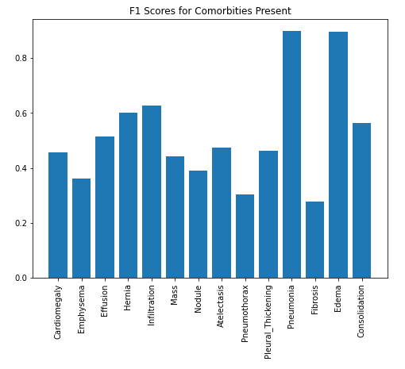
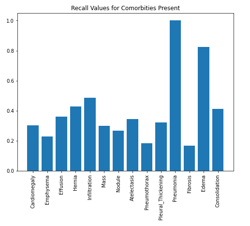
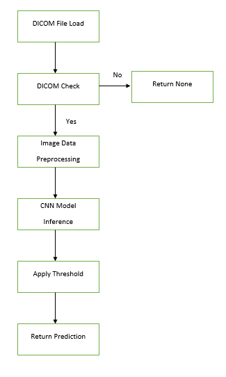
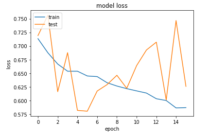
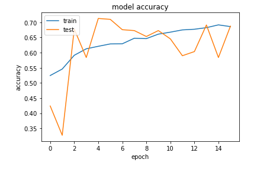
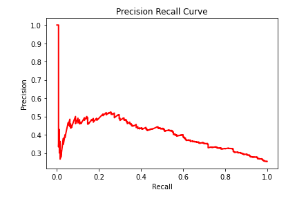
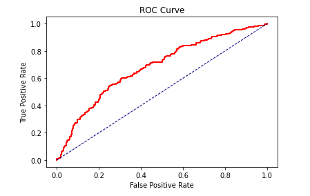
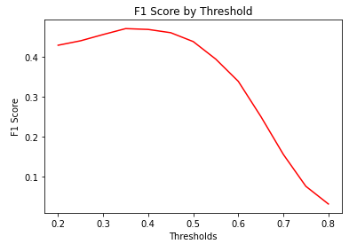
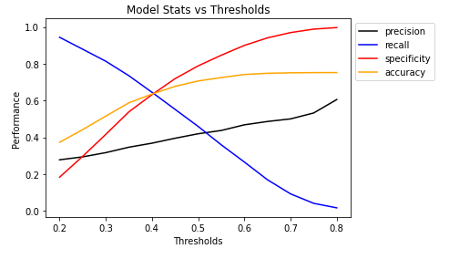
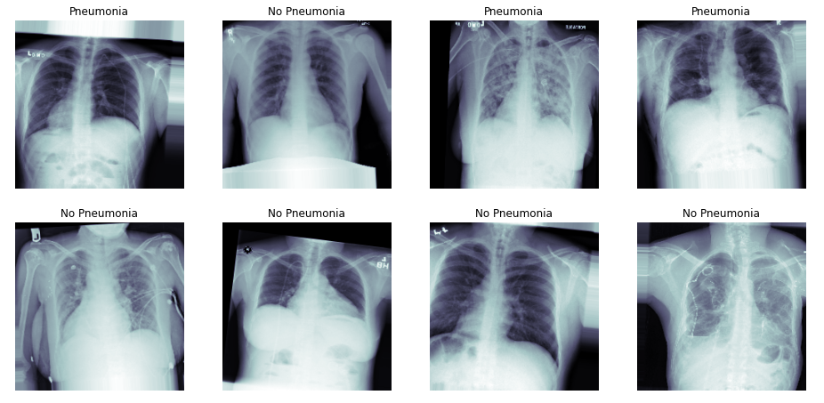

# X-Ray Pneumonia Classifier

**-----This Project is for Educational Purposes Only-----**

### Main Directory
- 
### Notebooks
- 
- 
- 
### Data Files
- 
- 
### Final Model
- 
### DICOM Files
- test1.dcm, test2.dcm, test3.dcm, test4.dcm, test5.dcm, test6.dcm
### Sample FDA Submission
- 

## Algorithm Description 

### 1. General Information

**Intended Use Statement:** 

Assist radiologists in diagnosing pneumonia from X-ray images 

**Indications for Use:**

For use on X-ray images from a patient population of ages 1-95 for both men and women. The indicated X-ray images are of the chest, in position AP (Anterior/Posterior) or PA (Posterior/Anterior), and modality of DX (Digital Radiography).

**Device Limitations:**

The model is recommended for use without the following comorbidities present in the patient:

    Fibrosis
    Pneumothorax
    
When these comorbidities are present it significantly affects the Recall and F1 score of the model at 0.3 threshold.

    Fibrosis Stats:
    Recall: 0.17
    F1 Score: 0.28

    Pneumothorax Stats:
    Recall: 0.18
    F1 Score: 0.30

**Clinical Impact of Performance:**

The main goal of this model is to increase the correct diagnosis of pneumonia. If the algorithm can alert the radiologist to likely pneumonia cases, then it help the radiologist know which X-ray images may need extra time to analyze. This could help the radiologist prioritize their time and increase productivity.

The statistics for the model are:
    - Recall: 0.814
    - Accuracy: 0.515
    - F1: 0.456
    - Precision: 0.316
    - Specificity: 0.416

This means that the chance of a pneumonia case X-ray image being labeled as No Pneumonia is only 18.6%, which means that the Pneumonia cases will be very likely marked as such a allow the radiologist to be alerted. The trade-off that of a high number of false positives indicated by 1 - Precision means that 68.4% of the Pneumonia labeled images will actually be No Pneumonia but the radiologist will inspect them closely to make the final diagnosis. Since the F1 score is higher than the current best pneumonia X-ray algorithm, it can assist the radiologists more efficiently.

**F1 Scores:**

- Radiologist Avg. : 0.387 
- CheXNet          : 0.435 
- **Proposed Model   : 0.456** 

### 2. Algorithm Design and Function

**DICOM Checking Steps:**

The algorithm checks the following characteristics of the DICOM file:

    Patient Age between 1 and 95
    Examined Body Part is CHEST
    Patient Position is either PA (Posterior/Anterior) or AP (Anterior/Posterior)
    Modality is DX (Digital Radiography)

**Preprocessing Steps:**

The algorithm does the following preprocessing steps:

    Resizes the image from (1, 1024, 1024) to (244, 224)
    Normalizes the pixel intensities to a range of 0 to 1

**CNN Architecture:**

The algorithm was created from a VGG16 Neural Network freezing the layers up to Block Pooling 5 layer.

The following new layers were added and trained:
    
    Dropout(0.2)
    Dense(1024, 'relu')
    Dropout(0.2)
    Dense(512, 'relu')
    Dropout(0.2)
    Dense(256, 'relu')
    Dropout(0.2)
    Dense(128, 'relu')
    
The final layer is a Dense layer with one node and a sigmoid activation function

**The full CNN architecture:**

Layer (type)                 Output Shape              Param #   
_________________________________________________________________
_________________________________________________________________

input_3 (InputLayer)         (None, 224, 224, 3)       0         
_________________________________________________________________
block1_conv1 (Conv2D)        (None, 224, 224, 64)      1792      
_________________________________________________________________
block1_conv2 (Conv2D)        (None, 224, 224, 64)      36928     
_________________________________________________________________
block1_pool (MaxPooling2D)   (None, 112, 112, 64)      0         
_________________________________________________________________
block2_conv1 (Conv2D)        (None, 112, 112, 128)     73856     
_________________________________________________________________
block2_conv2 (Conv2D)        (None, 112, 112, 128)     147584    
_________________________________________________________________
block2_pool (MaxPooling2D)   (None, 56, 56, 128)       0         
_________________________________________________________________
block3_conv1 (Conv2D)        (None, 56, 56, 256)       295168    
_________________________________________________________________
block3_conv2 (Conv2D)        (None, 56, 56, 256)       590080    
_________________________________________________________________
block3_conv3 (Conv2D)        (None, 56, 56, 256)       590080    
_________________________________________________________________
block3_pool (MaxPooling2D)   (None, 28, 28, 256)       0         
_________________________________________________________________
block4_conv1 (Conv2D)        (None, 28, 28, 512)       1180160   
_________________________________________________________________
block4_conv2 (Conv2D)        (None, 28, 28, 512)       2359808   
_________________________________________________________________
block4_conv3 (Conv2D)        (None, 28, 28, 512)       2359808   
_________________________________________________________________
block4_pool (MaxPooling2D)   (None, 14, 14, 512)       0         
_________________________________________________________________
block5_conv1 (Conv2D)        (None, 14, 14, 512)       2359808   
_________________________________________________________________
block5_conv2 (Conv2D)        (None, 14, 14, 512)       2359808   
_________________________________________________________________
block5_conv3 (Conv2D)        (None, 14, 14, 512)       2359808   
_________________________________________________________________
block5_pool (MaxPooling2D)   (None, 7, 7, 512)         0         
_________________________________________________________________
flatten_3 (Flatten)          (None, 25088)             0         
_________________________________________________________________
dropout_7 (Dropout)          (None, 25088)             0         
_________________________________________________________________
dense_7 (Dense)              (None, 1024)              25691136  
_________________________________________________________________
dropout_8 (Dropout)          (None, 1024)              0         
_________________________________________________________________
dense_8 (Dense)              (None, 512)               524800    
_________________________________________________________________
dropout_9 (Dropout)          (None, 512)               0         
_________________________________________________________________
dense_9 (Dense)              (None, 256)               131328    
_________________________________________________________________
dropout_10 (Dropout)         (None, 256)               0         
_________________________________________________________________
dense_10 (Dense)             (None, 128)               32896     
_________________________________________________________________
dense_11 (Dense)             (None, 1)                 129       

_________________________________________________________________

Total params: 41,094,977
Trainable params: 28,740,097
Non-trainable params: 12,354,880
_________________________________________________________________

### 3. Algorithm Training

**Parameters:**
* Types of augmentation used during training

    horizontal flip
    height shift: 0.1
    vertical shift: 0.1
    rotation angle range: 0 to 20 degrees
    zoom: 0.1
    
* Batch size: 32
        
* Optimizer learning rate: Adam 1e-4

* Layers of pre-existing architecture that were frozen

    VGG16 network layers until the block5_conv3 layer

* Layers of pre-existing architecture that were fine-tuned
    
    block5_conv3
    block5_pool

* Layers added to pre-existing architecture

    flatten_3
    dropout_7
    dense_7
    dropout_8
    dense_8
    dropout_9
    dense_9
    dropout_10
    dense_10
    dense_11 (Dense(1) output layer)

#### Model Results

The training set loss is consistently decreasing throughout the training, but the testing loss value is not consistent. This could be caused by not having a broad enough range of images in the testing dataset. This shows that the model may have over-trained on the training data and may need more bias added to become more generalized.

The accuracy of the training set consistently increases over the epochs. As well, the testing accuracy also improves dramatically from its starting amount. The testing accuracy has much more variance between epochs and as stated above may be due to it not being a broad enough range of images to be representative of what the model was trained on. Further analysis into the proportion of different co-morbidities and combinations of disease would be a good follow-up.

If the model requires precision to be optimized, then (Precision = 0.5, Recall = 0.3) provides a good optimization. If the model requires more recall to be optimized, then (Precision = 0.45, Recall = 0.5) would be a good optimization and this allows recall to be fairly high without losing much precision.

#### Model Statistics using different Thresholds

The ROC curve shows that the model definitely performs better than random guessing but is not amazingly better.

From threshold 0.32 to 0.47 the F1 score stays fairly flat and is at a large value. This gives a good range to choose from for the threshold.

For this specific use case, it seems more important to have a higher Recall since that indicates there are fewer False Negatives, meaning pneumonia cases predicted as no pneumonia. By reducing the number of False Negatives, we may have more False Positives, but as can be seen from the Precision Recall curve, the Precision only increases slightly, while Recall drops much more dramatically. Therefor we gain a lot of Recall while losing a little Precision by choosing a **threshold of 0.30** as opposed to 0.5 where the Recall has significantly decreased.

**Final Threshold and Explanation:**

At a threshold of 0.30, the model has a F1 score of 0.456 and a Recall score of 0.814. This was the highest F1 score when using a grid search of threshold values from 0.2 to 0.8 using 0.05 increments. From looking at the Recall plot, this is at or near the maximum F1 score for any threshold value.

When compared to the F1 scores of radiologist and the existing technology of CheXNet, the current model produces the highest F1 score. 

Results from [CheXNet: Radiologist-Level Pneumonia Detection on Chest X-Rayswith Deep Learning](https://arxiv.org/pdf/1711.05225.pdf)

| Person or Device | F1    |
|------------------|-------|
| Radiologist 1    | 0.383 |
| Radiologist 2    | 0.356 |
| Radiologist 3    | 0.365 |
| Radiologist 4    | 0.442 |
| Radiologist Avg. | 0.387 |
| CheXNet          | 0.435 |
| Proposed Model   | 0.456 |  

### 4. Databases
 (For the below, include visualizations as they are useful and relevant)

**Description of Training Dataset:** 
The training dataset contains 2290 images, which contains 1145 images with pneumonia and 1145 images with no pneumonia. This is a 50:50 split of positive labeled images to negative labeled images, to improve training of the model.

**Description of Validation Dataset:** 

The validation dataset contains 1144 images, which contains 858 images with no pneumonia and 286 images with pneumonia. This is a 75:25 split of positive labeled images to negative labeled images, to represent a more "real world" distribution.

### 5. Ground Truth

This dataset uses disease labels that were created using Natural Language Processing (NLP) to mine the associated radiological reports. Since it is from labels obtained from radiologist, the confidence of accurate labeling should be high. The only vulnerability is that there may be as much as 90% mislabeling due to the NLP model for extracting the labels from the report. The labels include 14 common thoracic pathologies: 

- Atelectasis 
- Consolidation
- Infiltration
- Pneumothorax
- Edema
- Emphysema
- Fibrosis
- Effusion
- Pneumonia
- Pleural thickening
- Cardiomegaly
- Nodule
- Mass
- Hernia 

The original radiology reports are not publicly available but you can find more details on the labeling process [here.](https://arxiv.org/abs/1705.02315) 

### 6. FDA Validation Plan

**Patient Population Description for FDA Validation Dataset:**

The following population subset is to be used for the FDA Validation Dataset:

    Men and Women
    Age 1 to 95
    Without known comorbid thoracic pathologies, 

**Ground Truth Acquisition Methodology:**

The gold standard for obtainin the ground truth for the FDA validation plan would be to use either a sputum culture or a pleural fluid culture. Both of these tests check fluid from the lungs and to whether there is certain bacteria there. These tests are expensive. Since this new technology is an algorithm to assist radiologists, it only requires the silver standard of the average of three radiologists. 

**Algorithm Performance Standard:**

To analyze the performance of the algorithm, it can be compared against the F1 score of the mean of three radiologists. According to the paper [CheXNet: Radiologist-Level Pneumonia Detection on Chest X-Rays with Deep Learning](https://arxiv.org/abs/1711.05225), the radiologists' average F1 score was 0.387. If the algorithm performs better than silver standard F1 score, it shows it can properly assist the radiologists in making diagnosis.
